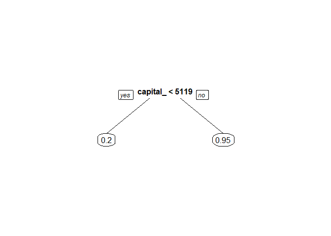

#### This R markdown file contains an analysis of US census data from 1996. I recommend implementing a logistic regression model to predict whether individuals, based on the census variables provided, make over $50,000/year. I also explored an initial random forest model, which has the potential to significantly outperform the logistic regression model once tuned, but to maintain interpretability, I prioritized the logistic regression model.

Before preparing the data for analysis, the following packages must be
loaded.

    library(DBI)
    library(corrplot)
    library(tidyverse)
    library(DataExplorer)
    library(caret)
    library(glue)
    library(car)
    library(rpart)
    library(rpart.plot)
    library(Hmisc)
    library(ROCit)
    library(randomForest)
    library(DBI)

To flatten the SQLite database into a data frame for analysis, I’ll read
the database into R using RSQLite.

    mydb <- dbConnect(RSQLite::SQLite(), "census_data.sqlite")
    dbGetQuery(mydb, "SELECT COUNT(*) FROM records;") 

    ##   COUNT(*)
    ## 1    48842

The database is now loaded as “mydb,” with 48,842 observations. Now,
I’ll flatten the database into a data frame using a series of joins and
close the SQLite connection.

    # If the view already exists, run the line below
    #dbExecute(mydb, "DROP VIEW [records_with_names]")
    # This query creates a view where the country_id, education_level_id, etc. are replaced 
    # in place by the country name, education_level name, etc., through a series of joins 
    dbExecute(mydb, " CREATE VIEW records_with_names AS 
                      SELECT
                          records.id,
                          records.age,
                          records.education_num,
                          records.capital_gain,
                          records.capital_loss,
                          records.hours_week,
                          records.over_50k, 
                          countries.name country_name,
                          education_levels.name education_level,
                          marital_statuses.name marital_status,
                          occupations.name occupation,
                          races.name race,
                          relationships.name relationship,
                          sexes.name sex,
                          workclasses.name workclass
                      FROM records
                      JOIN countries ON records.country_id = countries.id
                      JOIN education_levels ON records.education_level_id = education_levels.id
                      JOIN marital_statuses ON records.marital_status_id = marital_statuses.id
                      JOIN occupations ON records.occupation_id = occupations.id
                      JOIN races ON records.race_id = races.id
                      JOIN relationships ON records.relationship_id = relationships.id
                      JOIN sexes ON records.sex_id = sexes.id
                      JOIN workclasses ON records.workclass_id = workclasses.id; ") 

    data <- as.data.frame(dbGetQuery(mydb, "SELECT * FROM records_with_names ;")) # saves the view as "data"
    write.csv(data, file = "data.csv", row.names = FALSE)
    dbExecute(mydb, "DROP VIEW [records_with_names]") # drops the view to prevent errors when re-running the code from top to bottom
    dbDisconnect(mydb) 

Now that the data is flattened and loaded into the environment, I’ll do
some pre-processing and then Exploratory Data Analysis, beginning with
continuous variables.

    # The country, occupation, and workclass columns had a key corresponding to 
    # "?". I'll replace this character with "Missing"
    data <- data %>%
      mutate_all(~ ifelse(. == "?", "Missing", .))

    # Create vectors for column names by type
    vars <- colnames(data)
    cont_vars <- c("age", "education_num", "capital_gain", "capital_loss", "hours_week")
    cat_vars <- data %>%
      select(-matches(cont_vars), -c(id, over_50k)) %>% # keeps everything but continuous variables, id, and target
      names()

    # Convert categorical variables to factors
    for (var in cat_vars){
      data[[var]] <- as.factor(data[[var]])
    }

    # proportion or 0's and 1's for the target variable
    table(data$over_50k) # 37,155 0's
    37155/nrow(data) # 76% under 50k, 24% over 50k, not a rare event

    # Automated EDA report for continuous variables
    data %>%
      select(cont_vars, over_50k) %>%
          create_report(
            output_file  = "continuous_var_EDA.html",
            y            = "over_50k",
            report_title = "EDA Report - Over 50K census data"
        )

The EDA report (“continuous\_var\_EDA.html”) revealed that most
variables have a right-skewed distribution and education\_num and
hours\_week have clear modes between 8-12 and 40 respectively. Most
importantly, the box plots reveal that age, education\_num, and
hours\_week appear to have a relationship with the response, See the box
blot of hours\_week v. over\_50k below. Generally, individuals who work
more, are more likely to make over 50k annually.

    ggplot(data, aes(x = factor(over_50k), y = hours_week)) +
          geom_boxplot() +
          labs(title = "Box Plot: hours worked per week v. over 50k/year",
               x = "Over 50K",
               y = "hours worked per week")

Now let’s look at the categorical variables

    target_var <- "over_50k"
    for (var in cat_vars) {  # Create a bar plot for each categorical variable
      plot_data <- data.frame(x = data[[var]], target = data[[target_var]]) # subset data frame to the variable of interest
      
       p <- ggplot(plot_data, aes(x = x, fill = factor(target))) +
        geom_bar(stat = "count", position = "stack", color = "black") + # stacked bar plots with black outlines
        labs(title = paste("Distribution of", var, "by", target_var),
             x = var,
             y = "Observation Count",
             fill = target_var) +
        theme_minimal() +
        theme(axis.text.x = element_text(angle = 45, hjust = 1))   # Adjust the angle 
         # change background color
      # Save the plot to the EDA folder
      ggsave(paste("EDA/cat_v_target_", gsub(" ", "_", var), ".png", sep = ""), plot = p)
      
      if(var == "marital_status"){print(p)} # display the marital_status plot as an example in the html file
    }

These plots show the distribution of the categorical variables and their
relationship with the target. Some interesting relationships are that
married individuals have a higher chance of making over 50k a year than
all other categories with a reasonable sample size.

Now I’ll move on to logistic regression model considerations

    data <- data %>% select(-id) #drop  id
    # First I'll split the data into train/validation/ and test: 70/20/10 and check for any separation concerns
    set.seed(12345)
    trainIndex <- createDataPartition(data$over_50k, p = 0.7, list = FALSE)
    # Split into train and validation_test
    train <- data[trainIndex, ]
    validation_test <- data[-trainIndex, ]
    # Further split validation_test into validation and test
    validationIndex <- createDataPartition(validation_test$over_50k, p = 0.67, list = FALSE)
    validation <- validation_test[-validationIndex, ]
    test <- validation_test[validationIndex, ]

    sep_conc = c() # Will be populated if there are any separation concerns
    count = 1 # index for above vector, used in loop

    for (i in 1:length(train)){ # The first few lines of the loop prints the tables with variable comparisons.
      
      #print(glue("Table of {colnames(train)[i]} (left) v. over_50k (right)")) # prints the variable comparisons above each table
      #print(table(train[, i], train$over_50k)) # prints the actual table
      #cat("\n") # adds a space between each table
      if(0 %in% table(train[, i], train$over_50k)){ # If there are separation concerns (an observation value perfectly predicts the target)
        sep_conc[count] = colnames(train)[i] # append the variable to this list at position "count"
        count = count + 1 # count increases by one after each variable is added to sep_conc
      }
    }

    print(sep_conc) # The separation concerns for country_name, education_num, workclass, and education_level can easily be corrected by collapsing categories or removing an outlier(country_name).

    ## [1] "age"             "education_num"   "capital_gain"    "capital_loss"   
    ## [5] "hours_week"      "over_50k"        "country_name"    "education_level"
    ## [9] "workclass"

    train <- train[train$country_name != "Holand-Netherlands", ] # remove single observation from Holand-Netherlands

    train$education_num[which(train$education_num < 3)] <- "1-2" # collapses 1 and 2 into a single category
    train$education_num <- factor(train$education_num) # This variable is now categorical

    train$workclass[which(train$workclass == "Never-worked")] <- "Without-pay" # Converts Never-Worked observations to Without-pay 
    train$workclass[which(train$workclass == "Without-pay")] <- "Never-worked-or-Without-pay" # These categories are now one
    train$workclass <- factor(train$workclass) # re-factor

    train$education_level[which(train$education_num == "Preschool")] <- "4th-and-below" # Converts Preschool observations to 4th-and-below
    train$education_level[which(train$education_num == "1st-4th")] <- "4th-and-below"  # Converts 1st-4th observations to 4th-and-below
    train$education_level <- factor(train$education_level) # re-factor

Handling separation concerns with continuous variables - The continuous
variables with separation concerns are age, capital\_gain,
capital\_loss, and hours\_week. I’ll create bins for these variables
using decision trees

    age_tree <- rpart(over_50k ~ age, data = train, method = "anova")
    prp(age_tree)

    #Creating bins for age variable
    breaks <- c(0, 29, Inf)
    train$age <- cut(train$age, breaks = breaks, labels = c("<30", "30+"), include.lowest = TRUE, right = FALSE)

    capital_gain_tree <- rpart(over_50k ~ capital_gain, data = train, method = "anova")
    prp(capital_gain_tree)

    #Creating bins for capital_gain variable
    breaks <- c(0, 5118, Inf)
    train$capital_gain <- cut(train$capital_gain, breaks = breaks, labels = c("<5119", "5119+"), include.lowest = TRUE, right = FALSE)

    capital_loss_tree <- rpart(over_50k ~ capital_loss, data = train, method = "anova")
    prp(capital_loss_tree)

    #Creating bins for capital_loss variable
    breaks <- c(0, 1820, Inf)
    train$capital_loss <- cut(train$capital_loss, breaks = breaks, labels = c("<1821", "1821+"), include.lowest = TRUE, right = FALSE)

    hours_week_tree <- rpart(over_50k ~ hours_week, data = train, method = "anova")
    prp(hours_week_tree)

    #Creating bins for hours_week variable
    breaks <- c(0, 34, 43, Inf)
    train$hours_week <- cut(train$hours_week, breaks = breaks, labels = c("<35","35-43", "44+"), include.lowest = TRUE, right = FALSE)

Since all continuous variables are now binned, I can avoid the linearity
of the log(odds) assumption and can move on to modeling. I chose to
select variables through backward selection using AIC.

    full.model <- glm(factor(over_50k) ~ ., data = train, family = binomial(link = "logit")) # Full model contains all variables

    empty.model <- glm(factor(over_50k) ~ 1, data = train, family = binomial(link = "logit")) # Intercept only

    step_model <- step(full.model, trace = F, # backwards stepwise selection using AIC
                       scope = list(lower = empty.model, upper = full.model),
                       direction = "backward") 

    AIC(step_model)# 20,959.67

    ## [1] 20959.67

    # Sorting variables by p-value
    pval_df <- rownames_to_column(as.data.frame(Anova(step_model)[3]))
    colnames(pval_df) = c("variable", "pval")
    pval_df <- pval_df %>% arrange(pval)

    # gvifs <- vif(step_model)[,1] # checks model for collinearity concerns

    ###########################
    # When step_model is passed to gvifs, I get an error that there are aliases coefficients.  
    # I dropped marital_status and workclass and got a worse AIC, but I can trust the coefficients now
    ###########################

    new_model <- glm(factor(over_50k) ~ age + education_num + capital_gain + capital_loss + 
                     hours_week + country_name + occupation + race + relationship + sex,
                     data = train, family = binomial(link = "logit"))

    AIC(new_model)# 21,174.03

    ## [1] 21174.03

    gvifs <- vif(new_model)[,1]
    gvifs <- sort(gvifs, decreasing = T)
    print(gvifs) # collinearity issue solved, all gvifs < 5

    ##  relationship  country_name           sex          race    occupation 
    ##      3.298334      3.198232      2.861104      2.718267      2.098448 
    ## education_num    hours_week           age  capital_gain  capital_loss 
    ##      1.942396      1.183772      1.048156      1.033788      1.010181

    pval_df <- rownames_to_column(as.data.frame(Anova(new_model)[3])) # extracts p-value
    colnames(pval_df) = c("variable", "pval")
    pval_df <- pval_df %>% arrange(pval)

    main.effects.model <- new_model 

The power of logistic regression is the interpretable coefficients.
Exponentiating the coefficients and performing the below transformations
gives the percent change in odds from the reference level to the next
level of a variable.

    #summary(main.effects.model) # gives the model summary

    # the coefficient estimate for age30+ = 1.30728
    (exp(1.30728)-1) * 100 

    ## [1] 269.6107

Someone who is 30 years old or older has 269.61% higher odds of making
over 50K a year compared to someone who is 29 years old or younger.

Now that I’ve selected a final model, it’s time to test it on the
hold-out data. Since I didn’t validate more than one model, I’ll roll up
the validation and test sets. I’ll need to bin the variables in the same
way I binned the training variables

    test_set <- rbind(validation, test) # combine validation and test

    # Making the same transformations as in the train set 
    test_set$education_num[which(test_set$education_num < 3)] <- "1-2"
    test_set$education_num <- factor(test_set$education_num)

    test_set$workclass[which(test_set$workclass == "Never-worked")] <- "Without-pay"
    test_set$workclass[which(test_set$workclass == "Without-pay")] <- "Never-worked-or-Without-pay"
    test_set$workclass <- factor(test_set$workclass)

    test_set$education_level[which(test_set$education_num == "Preschool")] <- "4th-and-below"
    test_set$education_level[which(test_set$education_num == "1at-4th")] <- "4th-and-below"
    test_set$education_level <- factor(test_set$education_level)

    #Creating bins for age variable
    breaks <- c(0, 29, Inf)
    test_set$age <- cut(test_set$age, breaks = breaks, labels = c("<30", "30+"), include.lowest = TRUE, right = FALSE)
    #Creating bins for capital_gain variable
    breaks <- c(0, 5118, Inf)
    test_set$capital_gain <- cut(test_set$capital_gain, breaks = breaks, labels = c("<5119", "5119+"), include.lowest = TRUE, right = FALSE)
    #Creating bins for capital_loss variable
    breaks <- c(0, 1820, Inf)
    test_set$capital_loss <- cut(test_set$capital_loss, breaks = breaks, labels = c("<1821", "1821+"), include.lowest = TRUE, right = FALSE)
    #Creating bins for hours_week variable
    breaks <- c(0, 34, 43, Inf)
    test_set$hours_week <- cut(test_set$hours_week, breaks = breaks, labels = c("<35","35-43", "44+"), include.lowest = TRUE, right = FALSE)

    # Testing the model
    train$p_hat <- predict(main.effects.model, type = "response")
    somers2(train$p_hat, train$over_50k) #91.24% Concordance

    ##            C          Dxy            n      Missing 
    ## 9.124105e-01 8.248209e-01 3.418900e+04 0.000000e+00

    logit_roc <- rocit(train$p_hat, train$over_50k)
    plot(logit_roc) # model seems pretty good at classification, hard to judge without a direct comparison.
    logit_roc$AUC #0.912

    ## [1] 0.9124105

    plot(logit_roc)$optimal # Youden = 0.657 Cutoff = 0.244

    ##     value       FPR       TPR    cutoff 
    ## 0.6572742 0.1977403 0.8550145 0.2441286

    # I'll use the cutoff of .244 informed by Youden's J statistic

    pred_probs <- predict.glm(main.effects.model, newdata = test_set, type = "response" )
    test_set <- test_set %>%
      mutate(over_50k_hat = ifelse(pred_probs > 0.2441286, 1, 0), # predicted 1 or 0
             p_hat = pred_probs) # predicted probability

    logit_meas <- measureit(test_set$p_hat, test_set$over_50k, measure = c("ACC", "SENS", "SPEC")) # accuracy, sensitivity, and specificity
    acc_table <- data.frame(Cutoff = 0.2441286, Sens = logit_meas$SENS, Spec = logit_meas$SPEC,  Acc = logit_meas$ACC)
    head(arrange(acc_table, desc(Acc)), n = 1) # 85.7% accuracy at Youden's cutoff

    ##      Cutoff      Sens      Spec       Acc
    ## 1 0.2441286 0.5861265 0.9398449 0.8570161

The logistic regression model’s accuracy = 85.7%. Since this is census
data and likely for a government client where regulations are a concern,
I prioritized interpretability over prediction. However, I’ll quickly
make a random forest model to get an idea of what a machine learning
algorithm can provide.

I won’t need to worry about separation concerns or binning variables, so
I’ll just use the original data. I’ll also use a 70/30 train/test split

    set.seed(12345)
    trainIndex <- createDataPartition(data$over_50k, p = 0.7, list = FALSE)
    # Split into train and validation_test
    train_rf <- data[trainIndex, ]
    test_rf <- data[-trainIndex, ]

    set.seed(12345)
    rf <- randomForest(factor(over_50k) ~ ., data = train_rf, ntree = 500) # create the model, no tuning

Random Forest metrics

    train_rf$p_hat <- predict(rf, type = "prob") # predicted probabilities
    train_rf <- train_rf %>% mutate(p_hat = p_hat[,"1"]) # the above line 
    # saves the p_hat variable as "p_hat[,"1"]" this line changes it to just "p_hat"

    somers2(train_rf$p_hat, train_rf$over_50k) # Concordance = 90.1%

    ##            C          Dxy            n      Missing 
    ## 9.009556e-01 8.019112e-01 3.419000e+04 0.000000e+00

    logit_roc <- rocit(train_rf$p_hat, train_rf$over_50k)
    logit_roc$AUC #0.901

    ## [1] 0.9009556

    plot(logit_roc) # model seems comparable to logistic regression
    plot(logit_roc)$optimal # Youden = 0.633 Cutoff = 0.269

    ##     value       FPR       TPR    cutoff 
    ## 0.6330633 0.1429783 0.7760417 0.2690355

    pred_probs <- predict(rf, newdata = test_rf, type = "prob")
    test_rf <- test_rf %>%
      mutate(over_50k_hat = ifelse(pred_probs[,2] > 0.2690355, 1, 0),# predicted 1 or 0
             p_hat = pred_probs[,2]) # predicted probability

    logit_meas <- measureit(test_rf$p_hat, test_rf$over_50k, measure = c("ACC", "SENS", "SPEC")) # accuracy, sensitivity, and specificity
    acc_table <- data.frame(Cutoff = 0.2690355, Sens = logit_meas$SENS, Spec = logit_meas$SPEC,  Acc = logit_meas$ACC)
    head(arrange(acc_table, desc(Acc)), n = 1) # accuracy at Youden cutoff= 86.27%

    ##      Cutoff      Sens      Spec       Acc
    ## 1 0.2690355 0.5974934 0.9437662 0.8626809

The random forest model (RF) performed better than the logistic
regression model (LR) in terms of accuracy. The RF’s concordance is ~
1.1% lower than the LR’s, and the maximum accuracy is ~0.6% higher at
the optimal cutoff. An interesting next step would be to tune the random
forest model and try other machine learning models like XGBoost to see
if the metrics can be further improved.
